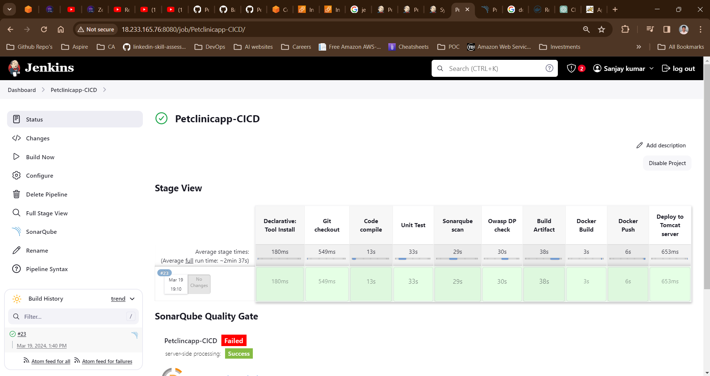
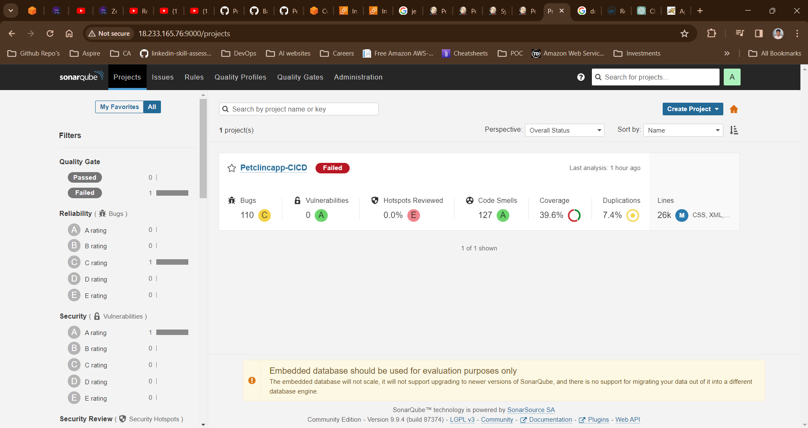
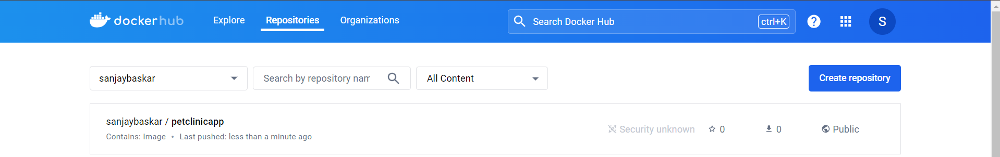
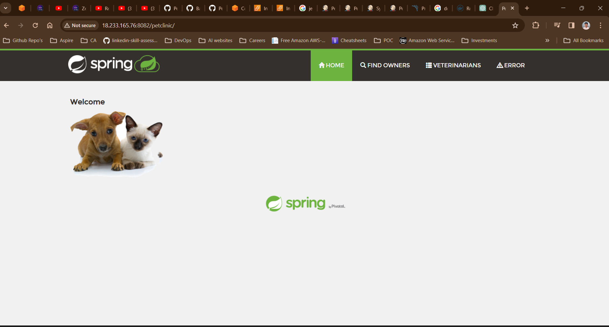

# Building a CI/CD Pipeline with Jenkins: A Step-by-Step Guide

In today's fast-paced software development landscape, Continuous Integration and Continuous Deployment (CI/CD) pipelines have become essential tools for ensuring the quality, reliability, and timely delivery of software products. In this blog post, we'll explore how to set up a robust CI/CD pipeline using Jenkins, a popular automation server, to automate the build, test, and deployment processes of a Java application.

## Prerequisites

Before we dive into setting up our CI/CD pipeline, make sure you have the following prerequisites:

- Access to a Jenkins server
- A Git repository hosting your Java application code
- Docker installed on your Jenkins server (if Docker is part of your deployment strategy)
- SonarQube configured for code quality analysis
- OWASP Dependency Check and Trivy for security vulnerability scanning (optional but recommended)
- Apache Tomcat (or any other servlet container) for deploying the application

## Setting Up the Jenkins Pipeline

We'll create a Jenkins pipeline that consists of several stages:

1. **Git Checkout**: Fetch the latest code from the Git repository.
2. **Code Compile**: Compile the Java code using Maven.
3. **Sonar Analysis**: Analyze the code quality using SonarQube.
4. **OWASP Dependency Check**: Scan for security vulnerabilities using OWASP Dependency Check.
5. **Code Build**: Build the application using Maven.
6. **Docker Build**: Build a Docker image of the application.
7. **Docker Push**: Push the Docker image to a Docker registry.
8. **Deploy to Tomcat**: Deploy the application to Apache Tomcat.

# Attached screenshots of the implementation

Output:

